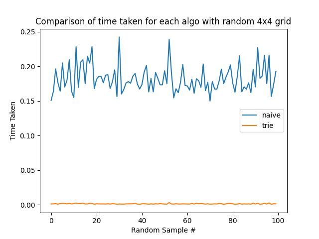
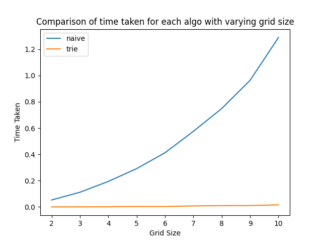

# Find words from a word grid
My solution to solve the word grid problem - finding valid English words from a grid


## Given Problem

On a 4x4 board, find words that can be formed by a sequence of adjacent (top, bottom, left, right, diagonal) letters. 

Words must be 3 or more letters.

You may move to any of 8 adjacent letters, however, a word should not have multiple instances of the same cell.

Assume we have a list of all valid english words

## Solution

This problem can be broken down to two sub problems:

* Enumerating all possible strings from the grid
* Testing if the string is a valid word

To enumerate all the possible strings, we can iterate over all the cells in the board one by one, and from each cell 
we will move to any one of its neighbors and then repeat this. 
 
Or We can assume the board as a fully connected graph, and perform DFS from each node generate the words.

### Naive Solution

A Naive way of solving this would be to go from the list of all valid words to the grid.

* Iterate through the list of all valid words 
* for each word check if the word can be formed from the grid:
    * iterate through the board cells
    * if the cell matches with word start
        * explore its neighbors and move to the cell which matches the second letter
        * move to that cell and repeat these steps until the whole word matches

#### Computation Analysis

Time Complexity: 

Assume a grid of size (MxM), the longest word is of len K and wordlist of size N,

For each word in the word list, we need to check all the possible cells in the grid and start the walk from each cell.
And the walks can be of max len of k

Thus time complexity = O(N * M*M * k)

Space Complexity: O(N) to store the word list

#### Problems with Naive:

Clearly from the complexities, we can see that we can do much better than naive. The major contributor to the complexity
is the size of the word list. If we assume it to be English dictionary then N >> M and N >> k. So we would need to remove 
the dependency of this N. One way to do it would be to reverse the approach; move from grid to the wordlist. First generate
words from the grid and check its validity. 


### Trie-based Solution
After studying the naive performance, we can optimize our solution by:

* Storing the words in a Hashed Trie/Prefix tree
* Traversing the trie and Grid at the same time/way
* Pruning the trie as we find words

As we observed from the naive solution, the major cost comes from the word membership check. One method is to use a hashset
which gives an O(1) access time on average. But on scale with a large set of words, we can not guarantee it to be collision-free.
Thus on a worst case it will perform with a O(n) access time which is same as that the wordlist.

‘Trie’ also known as a prefix tree is a tree data structure used to store character keys. Each node in the trie has 
children whose values (characters) lead to valid character keys.

The reason behind choosing this data structure is to use the ability to check if the prefix of the word exists in the 
trie. This is crucial, as we can stop dfs walking on the grid if the path we have found so far is not part of the tree.
This reduces the possible explorations and thus improving the performance on scale. The access time for Trie is O(k) where 
k is the max length of word.


#### Optimizations

Firstly using dictionaries (python) to build the tries. Thus taking O(1) access time to search for 
child nodes from parent. 

A naive way of using the tries, is to just use them as a dictionary to find words or prefix existence. In this method, 
we would be search for a word from the root everytime. Thus this would take O(k) time for each word. An optimized way to 
do this would be to walk in parallel on both the grid and the trie. This way, we can simply check if the current node of 
the trie is a terminating node signing the existance of the word. Thus taking O(1) for the operation of existence check.

Next, we can prune unwanted branches as we keep exploring the trie. Assume a word leads to the leaf of the trie,
once we add the word to our list, we can gradually start pruning from leaf to root as we backtrack our dfs walk. we do 
this until we find another terminator node (end of the word). And this would now be the leaf node. This works because all 
words are unique, hence once we find a word, we would never search for it again in the trie. As the complexity (both time 
and space) depends on the size of the trie, gradually pruning and shrinking the trie would greatly help the performance. 

#### Algorithm steps

* For each cell in the grid:
    * Start dfs walk from current cell
    * Mark the grid as visited 
    * Find the current character from the trie
    * Explore the intersection of neighbors of the grid and children of the trie node
    * Move to the neighbor on both grid and trie
    * keep doing this until you run out of neigbors or explored the whole grid
    * At each step of exploration check if the current node is a terminator node, if yes add the word to the found words
    * As you backtrack the exploration path, mark the nodes back to the original value on the grid and keep pruning the
      node from the tree

#### Complexity Analysis

Time Complexity:

Assume a grid of size (MxM), the longest word is of len K and wordlist of size N. 

Exploring every cell in the grid would contribute O(M * M)

For the dfs walk: At max, the cells will have 8 neighbors (center cells). We will only explore 7 of the neighbors (as parent would be 
one of the neighbors). Once we move to each of those cells, they will have 8 neigbors out which we will explore 7. This
keeps going till K nodes as a worst case. Thus contributing O(7^K) to the time complexity. This is the worst case, in
reality, the trie will be rapidly shrinking as we prune and thus reducing the number of neigbors to explore.

Thus time complexity = O (M * M * 7^K)

Space Complexity: O(N * k) - if there are N words in the dictionary each of length K and if they share no common prefixes


## Performance Analysis:

> Plot 1: This plot generates 100 random 4x4 grids and computes the time taken for each of the algorithm




> Plot 2: This plot generates grids of incremental sizes and computes the time taken for each of the algorithm



### Observations:

* From plot 1: Naive is clearly less optimal than trie-based by almost 3 orders of magnitude (Naive ~0.23s; trie ~ 0.0019s 
  (average time per grid))
* From plot 2: With varying sizes of the random grid, we can see that the time taken by naive grows exponentially while 
  time taken by the trie grows significantly slower
  
## Conclusion:

From the experiments we can clearly see that the trie-based solution outperforms the naive solution. 
As evident from plot 2, the exponential growth in time naturally leads to the conclusion that when we need to scale to 
a higher dimensional grid, we should opt for trie-based solution. 

As the word list’s size grows, the naive solution becomes progressively worse in terms of time complexity. 
Comparatively the Trie solution is fairly insensitive to the growth in both the grid size and the word list’s size.

## User Manual 

### System Requirments
* [Python 3.7](https://www.python.org/downloads/release/python-370/)

### Installation

#### Cloning the repo

```bash
$ git clone https://github.com/shivchander/word_grid_solver.git
```

#### Dependencies/Libraries

> All the required libraries are in [requirements.txt](requirements.txt), simply run this to install all the requirements

```bash
$ pip3 install -r requirements.txt
```

### File Structure

* ```main.py``` : contains the main fn to solve the word finder problem
contains a few util functions
* ```trie.py``` : contains the definition and declaration of the trie class
* ```board.py``` : contains the definition and declaration of the board/grid class
* ```solver.py``` : contains the Solver class and its trie solve and naive solve functions 
* ```grid.txt``` : grid of words to solve. Edit this to test on a custom grid
* ```wordlist.10000.txt``` : list of english words from [MIT.edu](https://www.mit.edu/~ecprice/wordlist.10000)

### Command line Args

```bash
$ python3 main.py 
    -default <bool>            # solves default board stored in grid.txt
    -random <bool>             # solves a random board of size (-size)
    -test <bool>               # runs the perfomance experiments and generates plots
    -size <int>                # specifies the board size for genrating the random grid
    -test_size <int>           # specifies the number of experiments to run to test performance
    -test_max_grid_size <int>  # specifies the max grid size to test
    -opt <str>                 # chooses which algorithm to run ("trie", "naive", "both")
```

### Sample Run and Output
```bash
$ python3 main.py 

Grid: 
[['r' 'a' 'e' 'l']
 ['m' 'o' 'f' 's']
 ['t' 'e' 'o' 'k']
 ['n' 'a' 't' 'i']]

Algo: trie
	 Result: ['ant', 'arm', 'ate', 'ati', 'atm', 'atom', 'ear', 'eat', 'ent', 'eos', 'fame', 'far', 'farm', 'fear', 'feat', 'foam', 'foo', 'foot', 'for', 'form', 'item', 'kit', 'leaf', 'leo', 'les', 'mae', 'mar', 'mean', 'meant', 'meat', 'men', 'ment', 'mentor', 'met', 'meta', 'nat', 'nato', 'neo', 'net', 'oem', 'ram', 'rom', 'rome', 'roof', 'root', 'sea', 'self', 'seo', 'ski', 'soa', 'sofa', 'tan', 'tea', 'ten', 'tent', 'toe', 'tom', 'too', 'took']
	 Num of Words: 59
	 Time: 0.002568960189819336

Algo: naive
	 Result: ['ant', 'arm', 'ate', 'ati', 'atm', 'atom', 'ear', 'eat', 'ent', 'eos', 'fame', 'far', 'farm', 'fear', 'feat', 'foam', 'foo', 'foot', 'for', 'form', 'item', 'kit', 'leaf', 'leo', 'les', 'mae', 'mar', 'mean', 'meant', 'meat', 'men', 'ment', 'mentor', 'met', 'meta', 'nat', 'nato', 'neo', 'net', 'oem', 'ram', 'rom', 'rome', 'roof', 'root', 'sea', 'self', 'seo', 'ski', 'soa', 'sofa', 'tan', 'tea', 'ten', 'tent', 'toe', 'tom', 'too', 'took']
	 Num of Words: 59
	 Time: 0.21023201942443848
```


